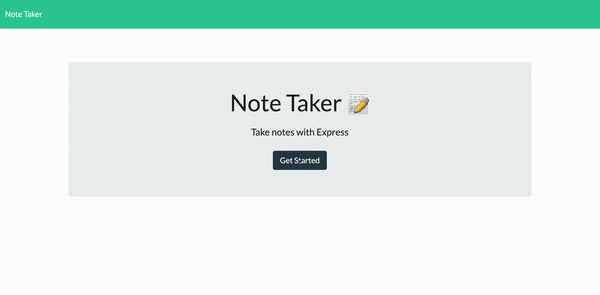

# Note Taker App "note-taker"
An app that uses Express.js to write and save notes.

Deployed: https://radiant-sands-89682.herokuapp.com/
## Table of Contents
  ---
* [Description](#description)
* [Installation](#installation)
* [Usage](#usage)
* [Contributing](#contributing)
* [Questions](#questions)

## Description
---
An app that uses Express.js to write and save notes.

## Installation 
---
If you want your own copy:
Make sure you have node js installed. Here is the link if needed: https://nodejs.org/en/download/
You can then fork & clone this repo so you have a copy of your own.
After you have cloned this repo and have a copy of it locally, in your terminal, change directories into the location you saved it in. Run npm install to install the package.

You can choose to deploy to Heroku if you wish, see documentation here: https://devcenter.heroku.com/articles/git

## Usage
---
Here is a video walk through of the user experience:

## Contributing
---
Author: Sommer Moya-Mendez

Thank you to Trilogy Education Services, LLC for providing the front end starter code.

## Questions
---

[GitHub](https://github.com/smoyamendez)

If you have any questions, please email me at: smoyamendez@gmail.com